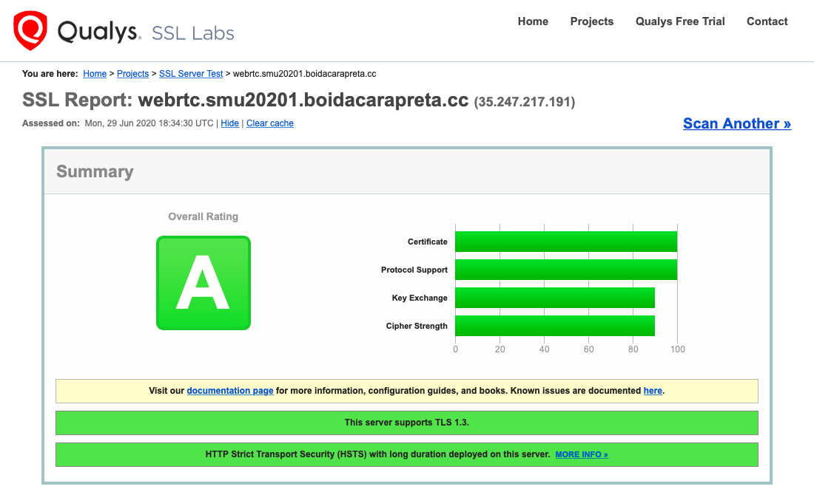

[](https://gitpod.io/#https://github.com/boidacarapreta/smu20201)

Este modelo define uma máquina virtual no Google Cloud com acesso a HTTPS (443/TCP e 443/UDP) e STUN (3478/UDP e 3478/TCP) sobre IPv4 fixo com registro DNS próprio.

Para usar, é preciso criar o arquivo de variáveis do Terraform, no seguinte formato:

```terraform
gcp_sakey = "***"
gce_project = "***"
gce_region = "***"
gce_zone = "***"
gce_ssh_user = "***"
gce_ssh_pub_key = "***"
gce_dns_zone_name = "***"
gce_dns_zone = "***"
```

onde:

- `gcp_sakey`: é a [chave de conta de serviço criada na GCP](https://console.cloud.google.com/apis/credentials/serviceaccountkey), em formato JSON.
- `gce_project`: nome do projeto.
- `gce_region`: região onde rodará a máquina virtual.
- `gce_zone`: dependente de `gce_region`, é a zona específica na região.
- `gce_ssh_user`: nome do usuário a ser criado dentro da máquina virtual.
- `gce_ssh_pub_key`: conteúdo do arquivo da chave pública SSH (não o nome do arquivo).
- `gce_dns_zone_name`: nome da zona registrada no GCP.
- `gce_dns_zone`: nome da zona DNS. Deve obrigatoriamente terminar com `.` (ponto final).

Exemplo de cenário a rodar na zona A de São Paulo:

```ini
gcp_sakey = "gcp.json"
gce_project = "teste-123456"
gce_region = "southamerica-east1"
gce_zone = "southamerica-east1-a"
gce_ssh_user = "boidacarapreta"
gce_ssh_pub_key = "ssh-rsa AAA...xWQ== ederson@boidacarapreta.cc"
gce_dns_zone_name = "smu20201"
gce_dns_zone = "smu20201.boidacarapreta.cc."
```

## Como usar o Terraform

Para facilitar o dia a dia, há o arquivo `Makefile`, que pode criar todo o ambiente:

```bash
make create
```

ou destrui-lo:

```bash
make destroy
```

Será criado o registro A no DNS: `webrtc.smu20201.boidacarapreta.cc.`

Nota importante: A configuração do Terraform, `gcp.tf`, é compatível com [versão 0.12 ou superior](https://www.terraform.io/docs/configuration/).

## Open-EasyRTC

A aplicação sugerida para análise de uma aplicação WebRTC é o [Open-EasyRTC](https://github.com/open-easyrtc/open-easyrtc). A recomendação é de instalação diretamente via `git clone`, e portanto é preciso adicionar manualmente um serviço no `systemd` para que rode como tal.

A seguir, o arquivo `/etc/systemd/system/open-easyrtc.service` atende minimamente os requisitos para o cenário informado:

```ini
[Unit]
Description=Open-EasyRTC
Documentation=https://github.com/open-easyrtc/open-easyrtc
After=network.target

[Service]
Type=simple
User=boidacarapreta
WorkingDirectory=/home/boidacarapreta/open-easyrtc/server_example
ExecStart=/usr/local/bin/npm start
Restart=on-failure

[Install]
WantedBy=multi-user.target
```

Destaque para os parâmetros `User` e `WorkingDirectory` que foram adaptados para este caso em especial. Estes são compatíveis com o parâmetro `gce_ssh_user` do arquivo `gcp.tfvars`, onde o repositório do Open-EasyRTC foi clonado na pasta pessoal do usuário `boidacarapreta`.

## NGINX como Proxy HTTP reverso

A configuração do servidor HTTP NGINX pode ser feita com algumas ferramentas.

### Certbot

A primeira delas é o [Certbot da EFF](https://certbot.eff.org). Com ele, é facilitada a configuração do certificado digital para HTTPS.

### Mozilla SSL Configuration Generator

A segunda ferramenta recomendada é o [gerador de configuração para HTTPS](https://ssl-config.mozilla.org) da Mozilla. Embora muito da configuração aplicada já seja feita pelo Certbot, é interessante adicionar alguns parâmetros para melhorar a segurança, como por exemplo OSCP.

### Suporte a WebSocket

A sinalização em WebRTC geralmente é feita com WebSocket. Assim, recomenda-se ativar o [suporte a proxy reverso de WebSocket do NGINX](http://nginx.org/en/docs/http/websocket.html).

### Configuração final

A título de ilustração, a [configuração final do arquivo NGINX que está em uso](https://webrtc.smu20201.boidacarapreta.cc) é esta:

```nginx
server {
    listen 80;
    server_name webrtc.smu20201.boidacarapreta.cc;
    if ($host = webrtc.smu20201.boidacarapreta.cc) {
        return 301 https://$host$request_uri;
    }
    return 404;
}

server {
    listen 443 ssl http2;
    server_name webrtc.smu20201.boidacarapreta.cc;
    ssl_certificate /etc/letsencrypt/live/webrtc.smu20201.boidacarapreta.cc/fullchain.pem;
    ssl_certificate_key /etc/letsencrypt/live/webrtc.smu20201.boidacarapreta.cc/privkey.pem;
    #include /etc/letsencrypt/options-ssl-nginx.conf;
    ssl_session_timeout 1d;
    ssl_session_cache shared:MozSSL:10m;
    ssl_session_tickets off;
    ssl_protocols TLSv1.3;
    ssl_prefer_server_ciphers off;
    add_header Strict-Transport-Security "max-age=63072000" always;
    ssl_stapling on;
    ssl_stapling_verify on;
    ssl_dhparam /etc/letsencrypt/ssl-dhparams.pem;
    location / {
        proxy_pass http://localhost:8080;
        proxy_http_version 1.1;
        proxy_set_header Upgrade $http_upgrade;
        proxy_set_header Connection "Upgrade";
        proxy_set_header Host $host;
    }
}
```

Para este arquivo é preciso adequar o nome do servidor (_host_). Todos os demais parâmetros foram criados pelas ferramentas de apoio.

Destaque apenas para a linha:

```ini
# include /etc/letsencrypt/options-ssl-nginx.conf
```

que foi comentada para aumentar a segurança com:

```ini
ssl_session_timeout 1d;
ssl_session_cache shared:MozSSL:10m;
ssl_session_tickets off;
ssl_protocols TLSv1.3;
ssl_prefer_server_ciphers off;
add_header Strict-Transport-Security "max-age=63072000" always;
ssl_stapling on;
ssl_stapling_verify on;
```

Sobre o WebSocket, foram adicionadas as seguintes linhas dentro do escopo de `location /`:

```nginx
proxy_http_version 1.1;
proxy_set_header Upgrade $http_upgrade;
proxy_set_header Connection "Upgrade";
proxy_set_header Host $host;
```

### SSL Labs

Por fim, a validação pode ser feita com o [testador da SSL Labs](https://www.ssllabs.com/ssltest/). Com as recomendações sugeridas e aplicadas, foi obtido nível A de segurança:


